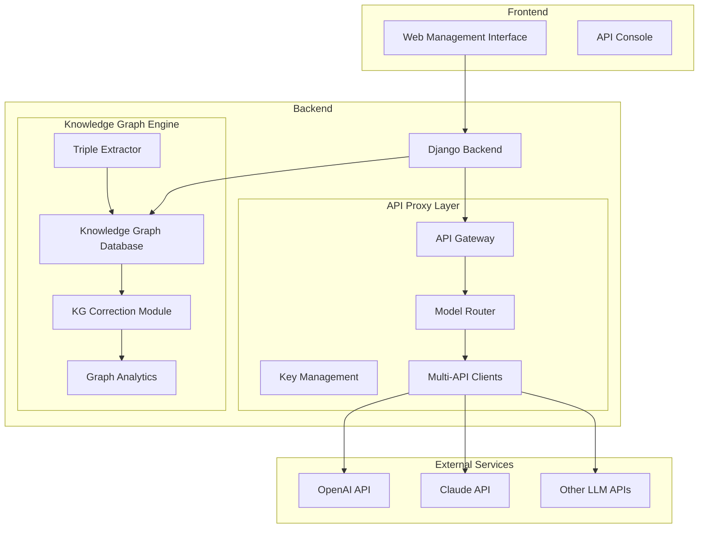

# PROM: Personal Knowledge Graph Construction with Large Language Models

**PROM** is a novel framework for **P**ersonal Knowledge G**r**aph C**o**nstruction with Large Language **M**odels. This system efficiently constructs Personal Knowledge Graphs (PKGs) from natural conversations, emphasizing context preservation and seamless knowledge fusion through LLM integration.

## 🚀 Overview

The growing volume of digital information requires effective Personal Knowledge Management (PKM). PROM addresses this challenge by automatically constructing knowledge graphs from unstructured conversational data, leveraging the power of Large Language Models to extract, integrate, and refine knowledge relationships.

### Key Features

- **🤖 LLM-Powered Extraction**: Utilizes prompt engineering and few-shot learning for accurate knowledge extraction
- **🔄 API Proxy Engine**: Supports multiple LLM backends (OpenAI, Claude, etc.) with unified interface
- **🧠 Knowledge Fusion**: Multi-strategy approach to resolve conflicts and enhance graph coherence
- **📊 Comprehensive Evaluation**: Multi-dimensional assessment including embedding analysis, link prediction, and RAG-based evaluation
- **🔧 Knowledge Correction**: Advanced correction mechanisms for graph quality improvement
- **📈 Visualization**: Interactive knowledge graph visualization and analytics

## 🏗️ Architecture



## 📁 Project Structure

```
personal_kg/
├── api_proxy/                 # API proxy application
│   ├── models.py              # Data models
│   ├── views.py               # API views
│   └── services/              # Service layer
├── knowledge_graph/           # Knowledge graph application
├── kg_correction/             # Knowledge graph correction module
│   ├── correction/            # Correction algorithms
│   ├── evaluation/            # Evaluation metrics
│   └── utils/                 # Utility functions
├── users/                     # User management
├── frontend/                  # Frontend static files
│   ├── css/                   # Stylesheets
│   ├── js/                    # JavaScript modules
│   └── templates/             # HTML templates
├── draft/                     # Research paper draft
├── eval_results_*/            # Evaluation results
├── conversation_data/         # Sample conversation datasets
└── exported_knowledge_graphs/ # Generated knowledge graphs
```

## ⚡ Quick Start

### Prerequisites

- Python 3.8+
- Node.js (for frontend dependencies, optional)
- Neo4j Database (for graph storage)
- Redis (for caching and task queue)

### Installation

1. **Clone the repository**
   ```bash
   git clone https://github.com/yourusername/personal-kg.git
   cd personal-kg
   ```

2. **Install dependencies**
   ```bash
   pip install -r requirements.txt
   ```

3. **Configure environment variables**
   ```bash
   cp .env.example .env
   # Edit .env with your API keys and database configurations
   ```

4. **Set up the database**
   ```bash
   python manage.py migrate
   python manage.py collectstatic
   ```

5. **Run the development server**
   ```bash
   python manage.py runserver
   ```

6. **Access the application**
   - Web Interface: `http://localhost:8000`
   - API Documentation: `http://localhost:8000/api/docs/`

## 🔧 Core Components

### 1. API Proxy Engine

The API Proxy Engine provides a unified interface for multiple LLM backends:

```python
from api_proxy.services.router import ModelRouter

# Route requests to appropriate LLM backend
router = ModelRouter()
response = router.route_request(
    model="gpt-4",
    messages=[{"role": "user", "content": "Extract knowledge from this text..."}]
)
```

### 2. Knowledge Extraction

Extract structured knowledge from conversational data:

```python
from knowledge_graph.services.extractor import TripleExtractor

extractor = TripleExtractor()
triples = extractor.extract_triples(
    text="John works at Microsoft in Seattle.",
    confidence_threshold=0.7
)
# Output: [(John, works_at, Microsoft), (Microsoft, located_in, Seattle)]
```

### 3. Knowledge Fusion

Refine and enhance extracted knowledge:

```python
from kg_correction.correction.corrector import KnowledgeGraphCorrector

corrector = KnowledgeGraphCorrector(kg_data=knowledge_graph)
corrector.correct_all()  # Apply all correction strategies
corrected_graph = corrector.get_corrected_graph()
```

## 📊 Evaluation Framework

PROM includes a comprehensive evaluation framework with multiple metrics:

### Running Evaluations

```bash
# Run complete evaluation pipeline
./evaluate_for_paper.sh

# Run specific evaluations
python evaluate_rag_impact.py --kg_path exported_knowledge_graphs/kg_sample.json
python entity_extraction_comparison_experiment.py
```

### Evaluation Metrics

- **Knowledge Graph Metrics**: Entity count, relation diversity, graph density
- **Domain Coverage**: Vocabulary coverage, contextual completeness
- **Embedding Analysis**: Entity clustering, classification accuracy
- **Link Prediction**: TransE embeddings, MRR, Hits@K metrics
- **RAG Evaluation**: Question answering performance, reasoning quality


### Key Findings

- **High Confidence Extraction**: 17.4% of triples extracted with confidence ≥ 0.9
- **Good Quality Coverage**: 41.9% of triples with confidence 0.7-0.8
- **Rich Semantic Diversity**: Over 140 distinct entity types captured
- **Balanced Connectivity**: Moderate graph density preventing over-connection
